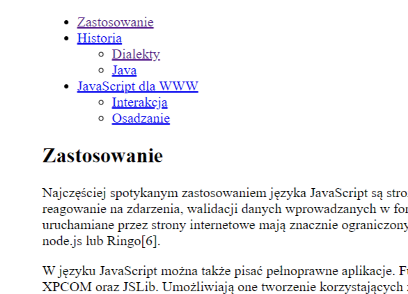

> ⭐ ***README** to coś więcej niż opis. Poprzez nie **pokazujesz swoje mocne strony** – swoją dokładność, sposób myślenia i podejście do rozwiązywania problemów. Niech Twoje README pokaże, że masz **świetne predyspozycje do rozwoju!***
> 
> 🎁 *Zacznij od razu. Skorzystaj z **[szablonu README i wskazówek](https://github.com/devmentor-pl/readme-template)**.* 

&nbsp;


# JavaScript: Elementy DOM

W tym projekcie będziemy musieli utworzyć nowe elementy w drzewie DOM, wyszukać już istniejące i dodać do nich odpowiednie klasy, atrybuty czy zawartość.

## Jaki mamy problem do rozwiązania?

Otrzymaliśmy gotowy kod HTML i CSS, ale niestety nie możemy go modyfikować. Wszystko musi zostać zrobione z poziomu kodu JS.

Zleceniodawca nie chce nam powiedzieć, dlaczego tak jest. Godzimy się na jego warunki, ponieważ chcemy zdobyć komercyjne doświadczenie!

### Problem 1: Wygenerowanie linków z *tooltipem* po najechaniu kursorem na element

> *Tooltip* to dymek z dodatkową informacją. Pojawia się on w okolicy elementu po kliknięciu lub najechaniu na niego. Przykład możemy zobaczyć [tutaj](https://www.w3schools.com/css/tryit.asp?filename=trycss_tooltip).

> Problem rozwiązujemy w pliku `./assets/js/introduction.js`

Musimy zmodyfikować element o klasie `.tooltip` w taki sposób, aby generował on prawidłową strukturę zgodną z CSS. Obecnie ten element wygląda w tak:

```html
<span 
    class="tooltip"
    data-url="https://pl.wikipedia.org/wiki/J%C4%99zyk_skryptowy" 
    data-tooltip-type="text"
    data-tooltip-content="Język skryptowy (ang. script language) – język programowania obsługujący skrypty[1]. Często służący do kontrolowania określonej aplikacji."
>
    skryptowy
</span>
```

Zwiera mnóstwo informacji. Nam zależy na tym, aby za ich pomocą utworzyć poniższy element:

```html
<span 
    class="tooltip"
    ...
>
    <a href="https://pl.wikipedia.org/wiki/J%C4%99zyk_skryptowy">
        skryptowy
    </a>
    <span class="tooltip__box tooltip__box--text">
        Język skryptowy (ang. script language) – język programowania obsługujący skrypty[1]. Często służący do kontrolowania określonej aplikacji.
    </span>
</span>
```

Zawartość elementu o klasie `.tooltip`, tj. tekst `skryptowy`, trzeba zamienić (nadpisać) na dwa elementy (dzieci). Należy zwrócić uwagę, że pierwszy z nich, `<a>`, zwiera tekst, który przed modyfikacją stanowi zawartość elementu o klasie `.tooltip`.

Musimy zatem dla każdego elementu o klasie `.tooltip` utworzyć dwoje dzieci, tj. `<a>` oraz `<span>`, z odpowiednimi atrybutami i zawartością, a następnie dodać je do `.tooltip`. Aby rozwiązać ten problem, użyj metody `.queyrSelectorAll()` i pętli  `for` lub metody `.forEach()`.

Zawartość dla elementów-dzieci pobierzesz z `dataset`:

 - adres dla linku => `.dataset.url`
 - typ tooltipa => `.dataset.tooltipType`
 - zawartość tooltipa => `.dataset.tooltipContent`.

Zwrócić uwagę, że mamy **różne typy tooltipów**. Może to być tooltip tekstowy (`text`) oraz obrazkowy (`image`).

Jeśli tooltip jest typem obrazkowym, musi mieć inną strukturę:

```html
<a href="https://pl.wikipedia.org/wiki/Strona_internetowa">
    stronach internetowych
</a>
<span class="tooltip__box tooltip__box--image">
    
</span>
```

Jeśli prawidłowo wykonamy podmianę struktury, to po najechaniu kursorem na `.tooltip` powinniśmy obok elementu zobaczyć dodatkową informację:


W zależności od typu tooltipa będzie ona inaczej wyglądać.

### Problem 2: Wygenerowanie spisu treści na podstawie tablicy obiektów

> Problem rozwiązujemy w pliku `./assets/js/list.js`.

Otrzymaliśmy od klienta spis treści w formie tablicy obiektów.

```javascript
const list = [
    {
        id: 1,
        parentId: null,
        text: 'Zastosowanie',
        link: '#Zastosowanie',
    },
    {
        id: 44,
        parentId: null,
        text: 'Historia',
        link: '#Historia',
    },
    {
        id: 7,
        parentId: 44,
        text: 'Dialekty',
        link: '#Dialekty',
    },
    {
        id: 31,
        parentId: 44,
        text: 'Java',
        link: '#Java',
    },
    {
        id: 24,
        parentId: null,
        text: 'JavaScript dla WWW',
        link: '#JavaScript_dla_WWW',

    },
    {
        id: 10,
        parentId: 24,
        text: 'Interakcja',
        link: '#Interakcja'
    },
    {
        id: 25,
        parentId: 24,
        text: 'Osadzanie',
        link: '#Osadzanie',
    }
];
```

Klient zaznaczył, że ta tablica może ulegać modyfikacji i nasze rozwiązanie musi być na tyle elastyczne, aby zmiana zawartości tablicy nie powodowała problemów z generowaniem spisu treści.

Tablica ta zawiera obiekty z odpowiednimi danymi:

```javascript
{
    id: 1,
    parentId: null,
    text: 'Zastosowanie',
    link: '#Zastosowanie',
}
```

gdzie:
* **id** – unikalny identyfikator każdego elementu
* **parentId** – id rodzica lub `null`; ten element określa, czy nasz obiekt jest dzieckiem (posiada ustawiony `parentId`), czy rodzicem (wówczas `parentId` ma wartość `null`)
* **text** – zawartość tekstowa dla elementu `<a/>`
* **link** – zawartość dla atrybutu `href` w `</a>`

Na podstawie tych danych musimy wygenerować taki kod HTML:

```html
<ul>
    <li data-id="1">
        <a href="#Zastosowanie">Zastosowanie</a>
        </li>
    <li data-id="44">
        <a href="#Historia">Historia</a>
        <ul>
            <li><a href="#Dialekty">Dialekty</a></li>
            <li><a href="#Java">Java</a></li>
        </ul>
    </li>
    <li data-id="24">
        <a href="#JavaScript_dla_WWW">JavaScript dla WWW</a>
        <ul>
            <li><a href="#Interakcja">Interakcja</a></li>
            <li><a href="#Osadzanie">Osadzanie</a></li>
        </ul>
    </li>
    <li data-id="6">
        <a href="Linki zewnętrzne">Przypisy</a>
    </li>
</ul>
```

i wstawić go do elementu `.article__list`.

Głównym problemem jest tutaj różny poziom zagnieżdżenia tych elementów. Moglibyśmy rozróżnić dwa poziomy:

 1. Pierwszy to ten, który dotyczy elementów o właściwości `.parentId` równej `null`.
 2. Drugi poziom to elementy, które mają rodziców.

#### Propozycja rozwiązania

> Ten problem jest na tyle złożony, że można go rozwiązać na wiele sposobów. Ja zaproponuję jeden z nich, ale to nie oznacza, że nie można zrobić tego inaczej (i lepiej!).

Najpierw generuję tylko elementy, które są na 1 poziomie zagnieżdżenia. Tutaj wykorzystuję `.forEach` lub pętlę `for` oraz warunek `if` wewnątrz iteracji. Sprawdzam tylko, czy `parentId` jest równe `null`. Jeśli tak, to tworzę odpowiednią zawartość, a do `dataset.id` dopisuję id elementu – aby potem wiedzieć, jaki ten element ma identyfikator. 

Wygenerowany kod powinien wyglądać mniej więcej tak:

```html
<li data-id="44"><a href="#Historia">Historia</a></li>
```

Następnie wyszukuję w dokumencie wszystkie `li` znajdujące się w odpowiedniej sekcji i znów wykorzystuję pętlę, aby odnieść się do każdego elementu z osobna.

Wewnątrz tej pętli mogę pobrać `id` danego elementu np. przez `const id = Number(item.dataset.id)`.

Następnie w tablicy `list` wyszukuję wszystkie obiekty, które posiadają `parentId` równy pobranemu `id`.

Mogę to zrobić za pomocą metody [`.filter()`](https://developer.mozilla.org/pl/docs/Web/JavaScript/Referencje/Obiekty/Array/filter) wykonanej na tablicy.

```javascript
const children = list.filter(function(element) {
    return element.parentId === id
});
```

Dzięki temu rozwiązaniu wiem, jakie elementy muszę utworzyć dla tego zagnieżdżenia (pamiętaj, że może ich nie być w ogóle). Znów piszę kod, który tworzy mi `ul` oraz pętlę dla `li`.

Efekt działania naszego kodu powinien być taki jak zakomentowany kod HTML w odpowiedniej sekcji.

Spis treści natomiast ma prezentować się mniej więcej tak:



Po kliknięciu w element listy powinieneś zostać przekierowany do odpowiedniego nagłówka w treści strony. 

Płynne przejście jest realizowane przez CSS! Zobacz reguły CSS przypisane do znacznika `html`.


&nbsp;

> ⭐ ***README** to coś więcej niż opis. Poprzez nie **pokazujesz swoje mocne strony** – swoją dokładność, sposób myślenia i podejście do rozwiązywania problemów. Niech Twoje README pokaże, że masz **świetne predyspozycje do rozwoju!***
> 
> 🎁 *Zacznij od razu. Skorzystaj z **[szablonu README i wskazówek](https://github.com/devmentor-pl/readme-template)**.* 
